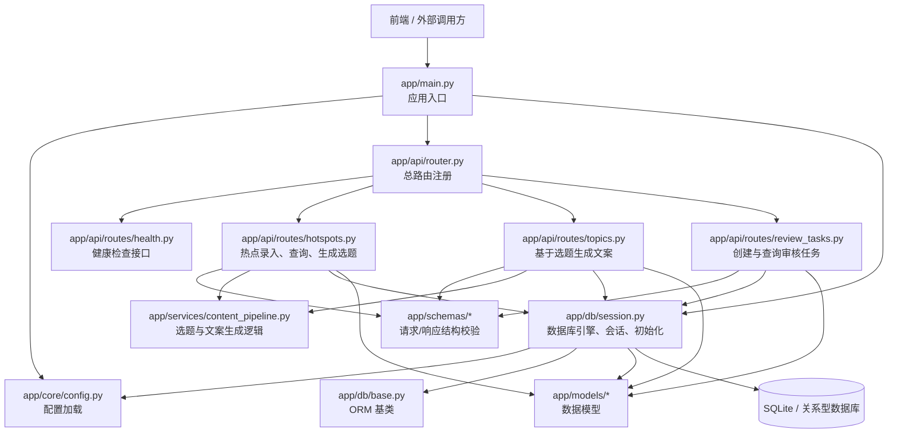
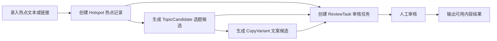
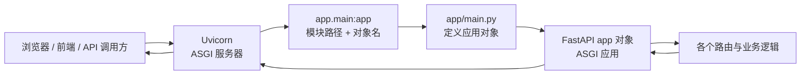

# Backend

V1 后端使用 FastAPI，当前主要承担四类职责：

1. 热点录入与查询
2. 选题和文案生成入口
3. 审核任务管理
4. 为后续扩展图片生成和发布辅助预留基础骨架

## 当前后端架构



## 模块说明

### 1. 应用入口

- `app/main.py` 负责创建 FastAPI 应用实例。
- 它会加载配置、注册总路由，并在启动时调用数据库初始化逻辑。
- 对外启动时，通常由 ASGI 服务器加载这里暴露的 `app` 对象。

### 2. 配置层

- `app/core/config.py` 负责集中管理配置。
- 当前配置包括应用名称、版本、API 前缀和数据库地址。
- 配置支持默认值，也支持通过 `.env` 文件覆盖。

### 3. API 路由层

- `app/api/router.py` 是总路由汇总入口。
- `app/api/routes/health.py` 提供服务健康检查接口。
- `app/api/routes/hotspots.py` 负责热点的新增、查询，以及基于热点生成选题。
- `app/api/routes/topics.py` 负责基于选题生成文案变体并查询文案结果。
- `app/api/routes/review_tasks.py` 负责创建审核任务和查询审核任务。

### 4. 数据访问层

- `app/db/session.py` 负责创建 SQLAlchemy 引擎、会话工厂和数据库初始化方法。
- `app/db/base.py` 提供 ORM 基类，供各个模型继承。
- 当前数据库默认是 SQLite，也保留了切换到其他关系型数据库的入口。

### 5. 模型与 Schema

- `app/models/*` 定义数据库中的核心实体，例如热点、选题候选、文案变体、审核任务。
- `app/schemas/*` 定义接口输入和输出的数据结构。
- 两者分工不同：models 面向数据库持久化，schemas 面向 API 参数校验和响应序列化。

### 6. 服务层

- `app/services/content_pipeline.py` 负责内容生成相关的业务逻辑。
- 当前已经被热点生成选题、选题生成文案两个流程调用。
- 这一层的作用是把业务逻辑从路由里拆出来，避免接口文件承担过多计算职责。

## 当前代码已经具备的骨架

- 应用入口
- 配置加载
- 路由注册
- 健康检查接口
- 热点、选题、文案、审核任务的基础 API
- 数据库初始化与会话管理
- 基础 models / schemas / services 分层

## 当前请求流转方式

1. 前端或外部客户端向 FastAPI 发起 HTTP 请求。
2. `app/main.py` 创建的应用接收请求并分发到总路由。
3. 具体 route 模块处理参数校验、调用服务逻辑、读写数据库。
4. `schemas` 负责约束输入输出结构，`models` 负责持久化数据。
5. 最终由 FastAPI 返回 JSON 响应，并自动生成接口文档。

## 当前业务流程图



### 业务流程说明

1. 用户先录入热点文本、标题或来源链接。
2. 后端创建 `Hotspot` 记录，作为整个内容生产链路的起点。
3. 热点接口会调用 `content_pipeline` 生成多个 `TopicCandidate` 选题候选。
4. 选题接口会继续基于选题和热点生成多个 `CopyVariant` 文案候选。
5. 审核任务接口可以关联热点、选题或文案，生成 `ReviewTask` 进入人工审核。
6. 审核通过后，后续可以继续对接图片生成、导出和发布辅助流程。

## 本地启动说明

### 1. 安装依赖

当前后端依赖定义在 `requirements.txt` 中，核心包括：

- FastAPI：Web API 框架
- Uvicorn：ASGI 服务器
- pydantic-settings：配置管理
- SQLAlchemy：ORM 和数据库访问

推荐步骤：

```bash
cd backend
python3 -m venv .venv
source .venv/bin/activate
pip install -r requirements.txt
```

如果你在 Windows PowerShell 中执行，激活命令通常是：

```powershell
.venv\Scripts\Activate.ps1
```

### 2. 配置 `.env`

当前配置由 `app/core/config.py` 读取，支持直接使用默认值，也支持通过 `.env` 覆盖。

可以在 `backend/` 目录下创建 `.env` 文件，例如：

```env
APP_NAME=XHS AI Content Workflow
APP_VERSION=0.1.0
API_PREFIX=/api/v1
DATABASE_URL=sqlite:///./xhs_workflow.db
```

说明：

- 不写 `.env` 也能启动，因为代码里已经提供了默认值。
- 当前默认数据库是 SQLite，数据库文件会落在后端目录下。

### 3. 启动服务

在 `backend/` 目录下执行：

```bash
uvicorn app.main:app --reload
```

命令解释：

- `app.main` 表示 Python 模块 `app/main.py`
- `:app` 表示加载该模块中的全局变量 `app`
- `--reload` 表示开发模式下监听文件变化并自动重启

### 4. 启动后可访问内容

- 接口根前缀：`/api/v1`
- Swagger 文档：`http://127.0.0.1:8000/docs`
- ReDoc 文档：`http://127.0.0.1:8000/redoc`
- 健康检查：`http://127.0.0.1:8000/api/v1/health`

### 5. 当前启动时会发生什么

1. Uvicorn 加载 `app.main:app`。
2. FastAPI 创建应用实例并注册所有路由。
3. 生命周期函数 `lifespan` 会调用 `init_db()`。
4. `init_db()` 会导入所有 models，并通过 SQLAlchemy 自动建表。
5. 服务启动完成后，即可通过接口录入热点并驱动后续流程。

## Uvicorn、FastAPI、ASGI 与 `app.main:app` 的关系



### 1. 什么是 Uvicorn

- Uvicorn 是一个 ASGI 服务器。
- 它的职责不是写业务逻辑，而是把你的 Python Web 应用真正跑起来。
- 它会监听端口、接收 HTTP 请求、把请求转发给 FastAPI，再把响应返回给客户端。

可以把它理解为“服务运行器”或“Web 服务器进程”。

### 2. 什么是 FastAPI

- FastAPI 是 Python 的 Web API 框架。
- 它负责定义接口、路由分发、参数校验、返回 JSON、自动生成接口文档。
- 在这个项目里，`FastAPI(...)` 创建出来的 `app` 就是整个后端应用对象。

也就是说：

- FastAPI 负责“应用内部怎么处理请求”
- Uvicorn 负责“把这个应用跑起来并对外提供网络服务”

也可以用一个更直观的类比来理解：

- FastAPI 是整个商场。
- `router.py` 是商场总导览台，负责把不同楼层和区域组织起来。
- `routes/*.py` 是各个具体店铺，真正处理某一类请求。

在这个类比里：

- 用户访问接口，就像顾客进入商场找目标店铺。
- `router.py` 负责告诉系统“这类请求应该分发到哪一组接口”。
- 具体的 `routes/*.py` 文件再真正处理对应业务，例如健康检查、热点录入、选题生成、审核任务管理。

### 3. 什么是 ASGI

ASGI 是 `Asynchronous Server Gateway Interface` 的缩写，可以理解成 Python 异步 Web 应用和服务器之间的一套通用接口标准。

它的作用是规定：

- 服务器应该怎样把请求交给应用
- 应用应该怎样把响应返回给服务器
- 双方怎样约定调用方式

你可以把 ASGI 理解成“插头标准”：

- 只要 Uvicorn 支持 ASGI
- 只要 FastAPI 应用实现了 ASGI 规范

那它们就能对接起来。

这和以前同步时代常见的 WSGI 类似，只是 ASGI 更适合异步场景，支持：

- `async def`
- 高并发请求处理
- WebSocket
- 长连接和流式响应

### 4. 为什么不是直接 `python3 app/main.py`

因为 [backend/app/main.py](backend/app/main.py#L1) 里的代码主要是在“定义应用”，不是“启动服务器”。

这个文件做的事情是：

- 导入依赖
- 定义 `lifespan`
- 定义 `create_app()`
- 创建全局变量 `app`

但它没有自己监听端口，也没有调用 Uvicorn 或其他服务器去持续接收请求。

所以如果直接运行：

```bash
python3 app/main.py
```

通常只会发生两件事：

1. Python 执行这个文件
2. 创建出 `app` 这个对象

然后进程就结束了，因为没有服务器循环在持续运行。

### 5. `app.main:app` 到底是什么意思

这是 Uvicorn 用来定位应用对象的写法，格式是：

```text
模块路径:对象名
```

在这里：

- `app.main` 表示模块 [backend/app/main.py](backend/app/main.py)
- `app` 表示该模块中的全局变量 [backend/app/main.py](backend/app/main.py#L53)

也就是说，`uvicorn app.main:app --reload` 的核心动作，可以近似理解为：

```python
from app.main import app
```

然后 Uvicorn 再去运行这个 `app` 对象，因为它是一个合法的 ASGI 应用。

### 6. Python 是不是“直接启动一个变量”

不是 Python 在“启动变量”，而是 Uvicorn：

1. 先根据字符串 `app.main:app` 导入模块
2. 再从模块里取出名为 `app` 的对象
3. 检查这个对象是不是可运行的 ASGI 应用
4. 如果是，就由服务器把它跑起来

所以这里的关键不是“变量”这个形式，而是这个变量里保存的内容本身就是一个可运行的应用对象。

### 7. 为什么常见写法是全局 `app`

像下面这样：

```python
app = create_app()
```

好处是服务器加载模块时可以直接拿到现成的应用实例，启动命令也比较简单：

```bash
uvicorn app.main:app --reload
```

如果不用全局变量，也可以让 Uvicorn 调用一个工厂函数，例如：

```bash
uvicorn app.main:create_app --factory
```

这种方式表示：

- 不去读取变量 `app`
- 而是调用 `create_app()` 动态创建应用对象

当前项目使用的是更直接、更常见的全局 `app` 方式。

### 8. 这四者的职责分工

1. `app/main.py`：定义并暴露应用对象
2. FastAPI：处理路由、校验、文档和响应
3. ASGI：规定应用和服务器之间如何对接
4. Uvicorn：真正启动服务进程并监听端口

## 后续可继续补强的方向

1. 引入 repositories 层，进一步隔离数据库查询逻辑
2. 增加 tasks 层，承接异步生成、审核流转、发布辅助等后台任务
3. 补充鉴权、日志、异常处理、中间件
4. 为内容生成流程接入真实的大模型或外部服务
