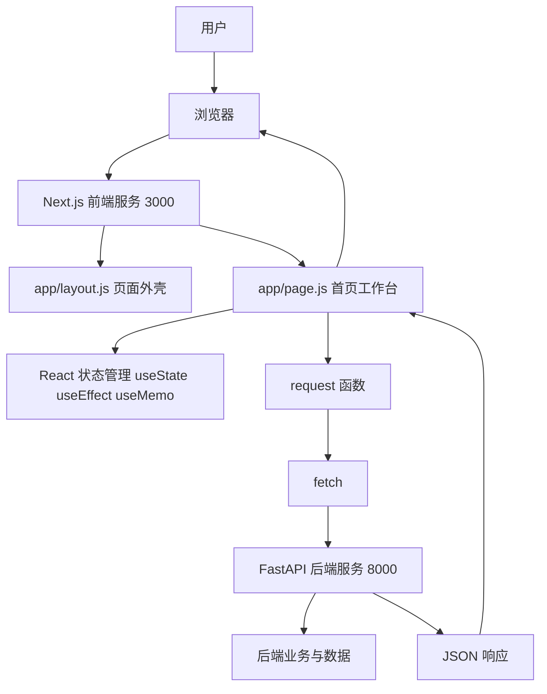
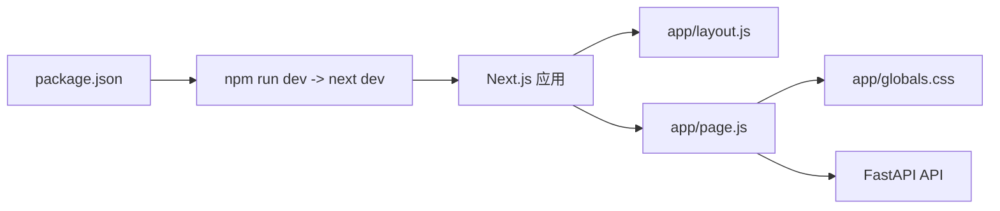
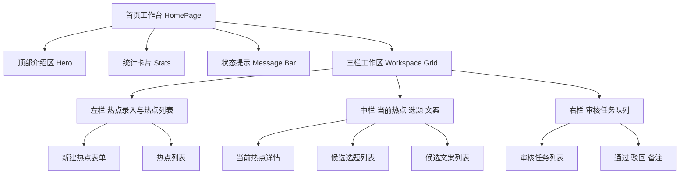
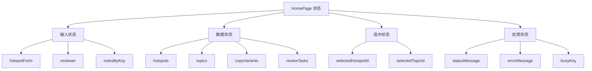
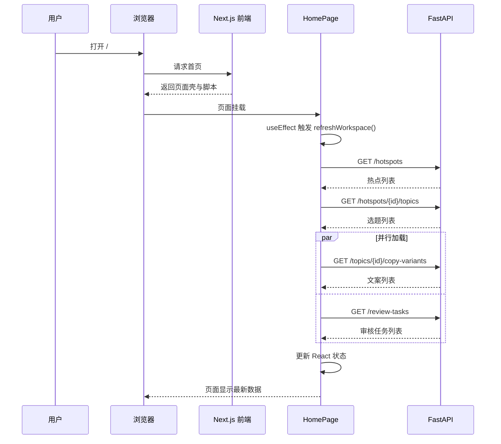
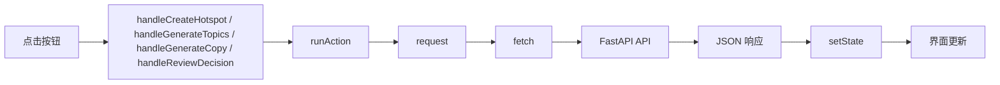
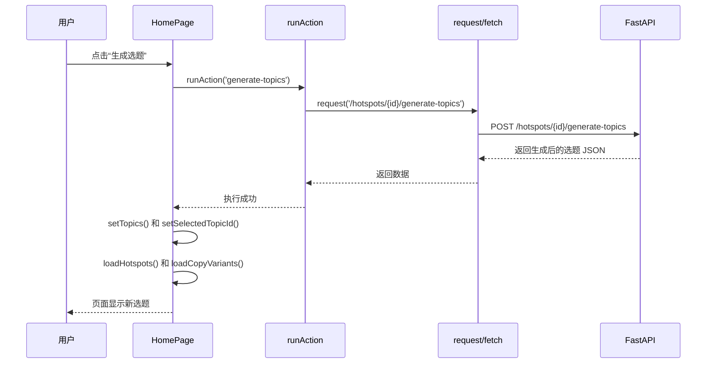
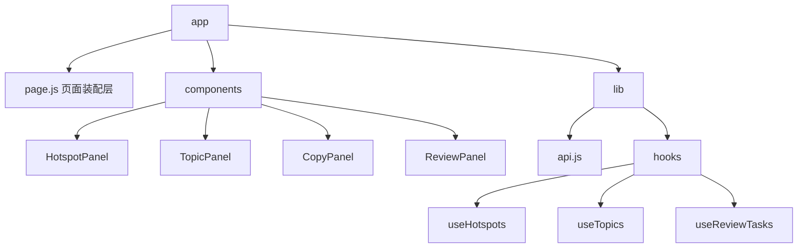

# 前端审核台架构入门

这篇文档专门解释当前 `frontend/` 目录里的前端架构，目标不是讲所有前端知识，而是帮你先理解这套项目现在怎么跑、怎么和后端配合、为什么代码会写成这样。

## 先给一个结论

当前前端可以概括成一句话：

**这是一个基于 Next.js App Router 的单页审核工作台，主要业务逻辑集中在首页客户端组件里，通过 `fetch` 直接调用 FastAPI 后端接口。**

如果你是前端初学者，可以先把它理解成下面这套关系：

1. Next.js 负责把页面跑起来
2. React 负责管理页面状态和按钮点击后的界面更新
3. `page.js` 负责组织页面内容、状态、事件和接口调用
4. FastAPI 负责真正的数据处理和业务逻辑
5. 浏览器只是最终看到结果的地方

## 1. 当前前端整体架构

### 1.1 技术栈角色分工

- Next.js：前端应用框架，负责启动前端服务、处理路由、组织页面结构
- React：负责组件、状态、事件响应和页面重渲染
- App Router：通过 `app/` 目录决定页面路由
- 浏览器 `fetch`：负责向后端发送 HTTP 请求
- FastAPI：提供热点、选题、文案、审核任务相关接口
- CSS：负责页面外观和布局

### 1.2 整体架构图



这张图可以这样理解：

1. 你在浏览器访问 `http://127.0.0.1:3000`
2. Next.js 找到首页对应的 `app/page.js`
3. 页面中的 React 代码开始工作
4. React 调用 `request()` 和 `fetch()` 去请求 FastAPI
5. FastAPI 返回 JSON
6. React 更新状态
7. 浏览器重新显示最新界面

## 2. 当前目录和文件分工

当前前端骨架很轻，关键文件不多：

- `frontend/package.json`：项目说明书，声明依赖和启动命令
- `frontend/next.config.mjs`：Next.js 配置，目前只有最基础设置
- `frontend/app/layout.js`：全局页面外壳和元信息
- `frontend/app/page.js`：当前核心业务页面，绝大部分逻辑都在这里
- `frontend/app/globals.css`：全局样式和布局样式

### 2.1 文件职责图



### 2.2 这几个文件分别干什么

#### `layout.js`

`layout.js` 可以理解成“所有页面共用的最外层壳子”。

当前它做的事情很少：

1. 引入全局样式 `globals.css`
2. 定义页面标题和描述
3. 设置 HTML 语言为中文
4. 把真正的页面内容 `children` 包进去

所以它更像是“全站公共容器”，不是业务逻辑中心。

#### `page.js`

这是当前项目前端最核心的文件。它同时承担了：

1. 页面渲染
2. 页面状态管理
3. 页面初始化加载
4. 按钮点击事件处理
5. 和后端通信
6. 成功失败提示

这意味着它现在是一个典型的“单页集中式实现”。

对初学者来说，这种写法反而比较容易入门，因为你只看一个文件就能把大部分流程串起来。

#### `globals.css`

它负责页面的外观，不负责业务。你可以把它理解成：

1. 页面背景长什么样
2. 卡片是什么样
3. 三栏布局怎么排
4. 按钮、输入框、提示条长什么样

所以 CSS 是“视觉层”，`page.js` 是“行为层”。

## 3. 页面内部是怎么分层的

虽然当前只有一个首页，但它内部已经分成比较明确的几个功能区。

### 3.1 页面结构图



### 3.2 三栏分别解决什么问题

#### 左栏：录入和选择热点

左栏负责两个动作：

1. 新建热点
2. 从已有热点里选一个作为当前处理对象

它相当于整个流程的入口。

#### 中栏：围绕当前热点推进内容生产

中栏是核心工作区，主要顺序是：

1. 先看到当前选中的热点
2. 点击“生成选题”
3. 选择一个选题
4. 点击“生成文案”
5. 看到候选文案
6. 把某条文案送审

所以中栏是从“热点”推进到“文案”的生产区。

#### 右栏：处理审核任务

右栏是审核台，负责：

1. 展示审核任务列表
2. 给任务写审核备注
3. 点击通过
4. 点击驳回

所以右栏是最终的人工决策区。

## 4. 当前前端状态管理方式

当前没有使用 Redux、Zustand 这类独立状态库，而是直接用 React 自带的 `useState`、`useEffect`、`useMemo`。

这说明当前状态管理策略是：

**把页面需要的数据都放在首页组件本地状态里。**

### 4.1 状态分类图



### 4.2 为什么这样写

这种写法有几个明显优点：

1. 简单直接，适合 V1
2. 逻辑集中，调试路径短
3. 不需要先引入额外状态库

但也有代价：

1. `page.js` 会越来越长
2. 各种状态容易堆在一起
3. 后面如果页面变多，复用会变差

所以这是一种“先跑通，再拆分”的架构选择。

## 5. 页面初始化时发生了什么

页面第一次打开后，不是静止的，它会自动去请求后端数据。

当前首页通过 `useEffect` 在加载时调用 `refreshWorkspace()`，这个函数会把工作台需要的核心数据拉回来。

### 5.1 初始化时序图



你可以把这段流程理解成：

1. 页面先被打开
2. 首页组件初始化
3. 首页主动去后端拿数据
4. 数据回来后存进状态
5. React 自动刷新界面

## 6. 点击按钮后是怎么和后端通信的

这个项目里，按钮和后端通信的套路是统一的，不是每个按钮都自己乱写一套。

整体模式是：

1. 用户点击按钮
2. 触发某个事件处理函数
3. 事件处理函数调用 `runAction()`
4. `runAction()` 再调用具体任务
5. 具体任务内部调用 `request()`
6. `request()` 用 `fetch()` 请求 FastAPI
7. 后端返回 JSON
8. 前端更新状态并刷新界面

### 6.1 按钮调用链图



### 6.2 以“生成选题”为例的时序图



所以你以后看到页面上的按钮，可以先问自己两个问题：

1. 这个按钮触发的是哪个 `handle...` 函数？
2. 这个 `handle...` 函数调用的是哪个 API？

这样你就能很快把页面行为读明白。

## 7. 为什么当前首页用了 `use client`

`page.js` 文件最上面有一行：

```js
'use client'
```

这句话的含义可以先简单理解成：

**这个页面需要在浏览器侧运行交互逻辑。**

为什么要这样做？因为当前页面有很多浏览器交互能力：

1. 输入框编辑
2. 按钮点击
3. `useState`
4. `useEffect`
5. `fetch` 请求
6. 动态刷新界面

如果没有 `use client`，这些典型交互式写法就不能直接这样用。

所以它是一个明显的“客户端交互页面”。

## 8. 当前架构的优点和局限

### 8.1 优点

1. 简单，容易上手
2. 所有关键流程都能在一个文件里追踪
3. 很适合先打通 V1 工作流
4. 前后端边界清晰，接口一目了然

### 8.2 局限

1. `page.js` 体积会继续膨胀
2. 组件复用还比较弱
3. API 调用和页面展示耦合较紧
4. 后续页面一多，继续堆在首页会难维护

## 9. 如果后面要继续演进，通常怎么拆

等功能再多一些，比较自然的演进路径是：

1. 把左栏、中栏、右栏拆成独立组件
2. 把 `request()` 和接口调用拆到 `services/` 或 `lib/api/`
3. 把热点、选题、文案、审核任务各自封装成自定义 Hook
4. 如果页面变多，再把不同工作区拆成多个路由页面

一个可能的后续目录形态如下：



## 10. 前端初学者建议怎么读这份代码

建议按下面顺序看：

1. 先看 `frontend/package.json`，理解怎么启动
2. 再看 `frontend/app/layout.js`，理解页面最外层是什么
3. 再看 `frontend/app/page.js` 顶部，先只看状态定义和 `request()`
4. 再看 `refreshWorkspace()` 和几个 `load...` 函数，理解初始化加载
5. 再看几个 `handle...` 函数，理解按钮如何和后端通信
6. 最后再看 JSX 返回结构，理解页面是如何渲染出来的
7. 样式看不懂时，再去对照 `frontend/app/globals.css`

## 11. 你现在最应该记住的三句话

1. 当前前端是一个单页工作台，不是复杂多页面网站
2. 当前核心逻辑主要集中在 `frontend/app/page.js`
3. 页面和后端通信的本质就是 React 事件函数里调用 `fetch`